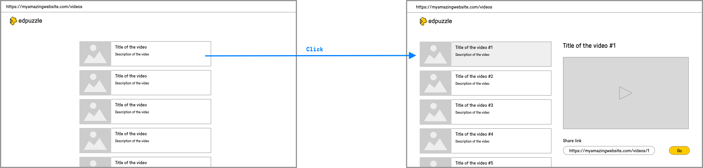
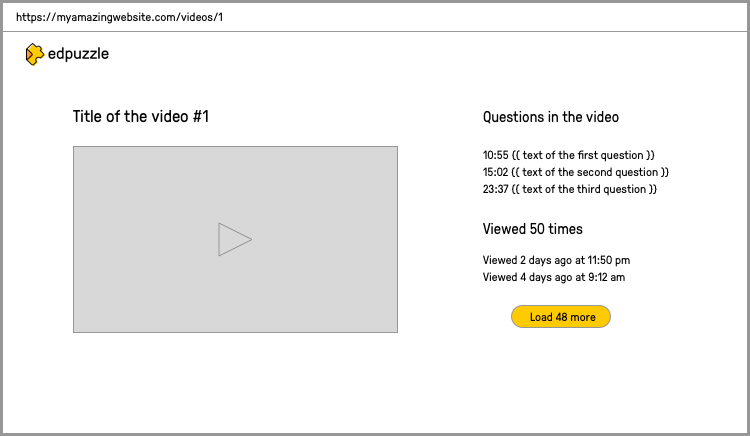

# 🚀 EdPuzzle Code Challenge

## 📦 Getting Started


Go inside the [apps/server](https://github.com/david-ramos-23/Edpuzzle-Code-Challenge/tree/main/apps/server) directory and rename **_.env.example_** to **_.env_**.

Also, you will need to fill up all the required variables to run the application.


## 🧑‍💻 Run Application locally

You will need to install the dependencies required for both apps (server & client) I use [pnpm](https://github.com/pnpm/pnpm) as a package manager but feel free to use npm or yarn or whatever you like the most. 

1. Install dependencies
```bash
npm install
# or
yarn install
# or
pnpm install
```

2. Start both applications
```bash
pnpm dev
```

The command will open a new tab in the Browser automatically. The server app should start in http://localhost:3000 and the client app in http://localhost:5173

## 🛠️ Tests

I used Jest + Supertests in the server and Vitest + RTL in the client.

To execute the tests in both applications you need to run:

```bash
npm test
# or
yarn test
# or
pnpm test
```
    
## ⭐️ Technologies

- [Vite](https://vitejs.dev) with [React](https://reactjs.org), [TypeScript](https://www.typescriptlang.org)
- [Tailwind CSS v3](https://tailwindcss.com) with a [basic reset for form styles](https://github.com/tailwindlabs/tailwindcss-forms) and a [Prettier plugin](https://github.com/tailwindlabs/prettier-plugin-tailwindcss) that automatically sorts classes.
- Unit and integration tests with [Vitest](https://vitest.dev/) and [Testing Library](https://testing-library.com/) in the client.
- [Jest](https://jestjs.io/) with [Supertest](https://github.com/ladjs/supertest) in the server
- [Prettier](https://prettier.io/) - A code formatter to ensure consistent code style.
- [ESLint](https://eslint.org/) - A pluggable JavaScript linter to enforce coding standards.

## 🤔 Improvements
- Add more Unit Tests and e2e Tests
- Shared Types package
- Pagination in all endpoints
- Deploy on Vercel
- Add Husky precommit git hook
- Dockerize App
- PWA
  


Hi David! We're as excited as you are to start this code challenge and at the prospect of working together in the future. Before we get started, we want to communicate the following:

1. The code you create for this challenge will never be used by Edpuzzle under any circumstances.
2. The goal is to take a look at your fullstack developer skills when working on a "real life" problem. We don't expect 100% perfection but we are looking for very thoughtful iteration.
3. Remember that if the challenge goes well, there will be an opportunity to talk through about all your decisions, issues found, etc. with the other Edpuzzle team members. Writing those down as they happen is generally a good idea.
4. During the challenge you'll be assigned one or two mentors from the Edpuzzle team. This means that you can contact them via Slack to answer any question that you might have. We're looking for an excellent developer and an even better teammate.
5. If you think of anything we could improve in this challenge after you've completed it, we'd love to get your honest feedback.

# Code Challenge

## Description

Your challenge will be to build an app that can display a list of videos that contain embedded questions in them. The app must also be capable of playing any of these videos and pausing them once it's time to display a question. If you enjoy building this mini application, you'll definitely love working with us on the full Edpuzzle product!

## Instructions

You've been given this Github repository where you'll have to submit your work. We won't be checking commits as you're still working on the challenge so don't worry about pushing incomplete code to Github. You will be presenting the results of the code challenge to 2 Edpuzzle team members so we recommend that you write down your decisions so you can remember to talk about them with us.

### Instructions: Backend

You can find the credentials to connect to a MongoDB database at the end of this README file. This database contains two collections:

1. A collection called **videos** that contains several interactive videos from YouTube. An interactive video is the combination of a YouTube video, see the videoId field, and several open questions at different times during the video. Each question has a foreign key "questionId". This is an example of the shape documents in this collection have:

```
Video Schema

{
	_id: ObjectId,
	videoId: String representing the id of a YouTube video,
	title: String,
	author: String,
	questions: [
		{
			time: Integer that represents the time in seconds where this question is located,
			questionId: ObjectId
		},
		...
	]
}
```

2. A collection called **questions** that contains documents, each representing a question. This is an example of the shape a question document has inside the database:

```
Question Schema

{
	_id: ObjectId,
	text: String that represents the text of the question
}
```

You'll have to create a backend REST API in [Node.js](https://nodejs.org/en/) and [Express.js](http://expressjs.com/) with the following specific routes:

1. A route that returns a list of all videos in the **videos** collection, with their questions from the **questions** collection populated on each of the videos. You're not required to implement pagination but feel free to do so if you prefer. This is an example of the shape of the response of this API route:

```
GET /<name-of-your-route>
Response Body:

{
	data: [
		{
			_id: '557580900f2b07e0c39d23az',
			videoId: 'xA34kfi',
			title: 'History of the Roman Empire',
			author: 'National Geographic',
			questions: [
				{
					_id: 823890ffdbn,
					time: 10,
					text: 'What language was spoken in the Roman Empire?'
				}
			]
		},
		{
			_id: '557580900f2b07e0c39d23a0',
			videoId: 'iQWvc6qhTds',
			title: 'Flipping the Classroom: Explained!',
			author: 'Edpuzzle',
			questions: [
				{
					_id: '56b9eb939b1b0aaf44f2147a',
					time: 101,
					text: 'How do you feel about flipping your classroom?'
				},
				{
					_id: '56b9eb939b1b0aaf44f2147t',
					time: 130,
					text: 'How many years has Edpuzzle been around so far?'
				}
			],
		}
	]
}
```
Feel free to change this response shape if you add pagination to this route.

2. A route that returns a specific video from the **videos** collection with its questions populated. This is an example of the shape of the response of this API route:

```
GET /<name-of-your-route>
Response Body:

{
	data: {
		_id: '557580900f2b07e0c39d23a0',
		videoId: 'xA34kfi',
		title: 'History of the Roman Empire',
		author: 'National Geographic',
		questions: [
			{
				_id: '823890ffdbn',
				time: 10,
				text: 'What language was spoken in the Roman Empire?'
			}
		]
	}
}
```

3. Create the necessary route(s) you need to store analytics on amount and views the video has and when those happened. It is like the views in YouTube videos but with extra information about when each view has happened. Feel free to create the necessary collection(s) on the database to build this feature. In the frontend section of this challenge you can see a wireframe that shows how to display this information to the user.
Please do use pagination to fetch all the results. Use the pagination technique that you prefer.

4. A very useful piece of information the current app is missing is displaying the duration of each video in the videos screen. This duration isn't stored in the database and has to be retrieved directly from the YouTube Data API.
To accomplish this goal, you'll have to create a third REST API route that retrieves the duration of a specific video from the YouTube Data API. From the frontend, you'll have to display this duration information for each video in the videos screen.
Instructions on how to configure the YouTube Data Api can be found in one of the sections below.

### Instructions: Frontend

You'll build a frontend single page application with React. It will have 2 screens in 2 different routes/urls:

1. **Videos Screen** - A screen where the list of videos is shown. A video from the list can be clicked and a YouTube embedded player will appear without navigating to another screen. Below that video there will be a shareable link and button that allow navigation to a separate screen where the video player can be shown as a standalone element (see (2)). The following is an example of a wireframe that would accomplish this goal but you can modify it as you see fit.



2. **Video Player Screen** - A screen where the player is displayed withsome extra information around it and in a different url/route than the Videos Screen.



For the video player, you have to implement some code to open a browser native alert when the video reaches a time where it contains a question. In the alert, show the text of the question if the browser allows it.

## Technology Requirements

As a developer with testing experience, we would like to see those skills applied to the challenge. We don't expect you to test everything as the time for this challenge is short. You can test just enough to show us how you would get started testing in a real life project.

### Backend

- **Required** - Node.js with Express.js
- **Required** - MongoDB
- **Optional** - Mongoose.js for database schemas. Do not use Mongoose's `.populate()` or `.aggregate()` methods or `$aggregate` from MongoDB, to aggregate data between multiple collections. Please do that manually in your JavaScript code without relying on Mongoose or any other ORM.

Feel free to use any other technologies that you need both for the code as well as the tests.

### Frontend

- **Required** - React.js
- **Required** - Routing library of your choice like React Router
- **Required** - Please don't use a UI components library with pre-defined styles. Create your own components with your own style.
- **Required** - State management library like Redux

Feel free to use any other technologies that you need for the code as well as the tests.

### Database

We will provide the database connection information to you.

### YouTube Data API

In order to get data from the YouTube API from within the Node.js backend, you'll need to configure a "Service Account" first. You can find the documentation [here](https://developers.google.com/identity/toolkit/web/quickstart/nodejs#step_1_configure_the_google_identity_toolkit_api).

## Communication channels

An invitation to a private Slack channel will be sent to your email. You can use that channel to discuss anything related to the code challenge with your assigned mentor/s.

For questions or updates on your interview process, please use the same communication channel you were using before the code challenge.


